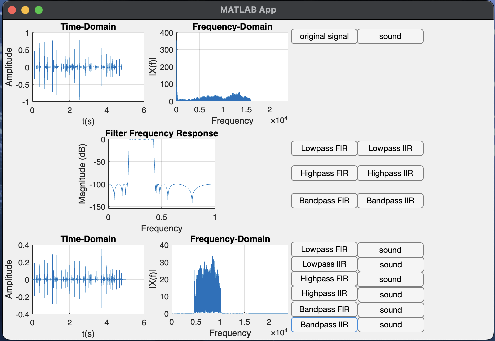

### DSP课程作业（Matlab处理语音信号）

主程序 main.m 含六种滤波器之设计，详细内容请君移步源码。

record_voice.m 负责录音，将录音结果保存至 record_audio.wav。

TimeFreq_plot.m 为绘图函数，供 main.m 调用。

speechDSP.mlapp 为GUI界面，我设计的界面如下，如你所见，它并不好看。

笔者注：代码系赶工所成，git提交杂乱无序，且其中部分内容因笔者技术有限，可能存误，请君小心参考。